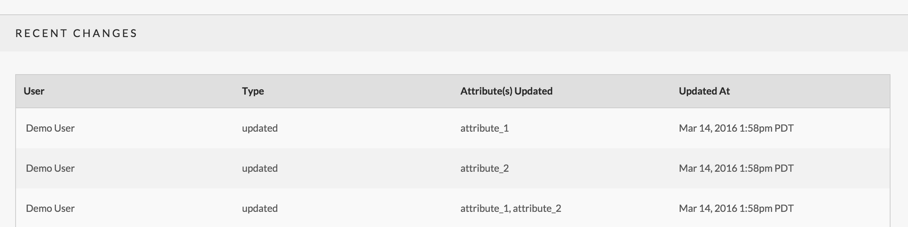

# Change Tracker

Fae has a build in system to track the changes of the records in your admin. By default it's on, tracking the last 15 times a record has been changed. Make sure any model you want to track has `include Fae::BaseModelConcern` at the top.

For each change the tracker tracks what kind of change it is (create, update or delete), what attributes were changed, who changed it and when it happened.

* [Global Options](#global-options)
* [Blacklisting Models and Attributes](#blacklisting-models-and-attributes)
* [Accessing the Tracked Changes](#accessing-the-tracked-changes)
* [Display Tracked Changes Table](#display-tracked-changes-table)

---

## Global Options

You can turn off tracking altogether or update how many revisions the tracker keeps with the following options set in `config/initializers/fae.rb`.

| key | type | default | description |
| --- | ---- | ------- | ----------- |
| track_changes | boolean | true | Determines whether or not to track changes on your objects
| tracker_history_length | integer | 15 | Determines the max number of changes logged per object

### Example

`config/initializers/fae.rb`
```ruby
Fae.setup do |config|

  config.tracker_history_length = 10

end
```

## Blacklisting Models and Attributes

If you want to turn off tracking on specific attibutes or a model altogether you can define an optional instance method `fae_tracker_blacklist`.

### Blacklisting a Model

To blacklist an entire model have `fae_tracker_blacklist` return 'all'.

```ruby
class DontTrackMe < ActiveRecord::Base
  include Fae::BaseModelConcern

  def fae_tracker_blacklist
    'all'
  end
end
```

### Blacklisting Attributes

To blacklist specific attributes have 'fae_tracker_blacklist' return an array of attribute names as symbols or strings.

```ruby
class DontTrackMe < ActiveRecord::Base
  include Fae::BaseModelConcern

  def fae_tracker_blacklist
    [:position, :slug]
  end
end
```

## Accessing the Tracked Changes

Each model that includes `Fae::BaseModelConcern` will have the following association:

```
has_many :tracked_changes
```

Each tracked change is a record of `Fae::Change` and has the following attrubtes available

| attribute | description |
| --------- | ----------- |
| `changeable` | a polymorphic association back to the changed record |
| `user` | an association to the user that updated the record |
| `change_type` | how the record was changed, options are: created, updated or deleted |
| `updated_attributes` | an array of attributes changed (for updated records only) |
| `updated_at` | when the change occured |

### Example Usage

```ruby
@item.tracked_changes.each do |change|
  "This item was #{change.change_type} by #{change.user.first_name} on {change.updated_at}."
end
```

## Display Tracked Changes Table

Fae provides a partial to display tracked changes in an object's form. Read more about `render 'fae/shared/recent_changes'`



Displays recent changes to an object as logged by change tracker in a table. Columns include the user, type, updated attributes, and datetime of the change.

This partial is best placed at the bottom of the form and will automatically hide itself in create forms, where there wouldn't be changes to display.

**Examples**

Standard implementation
```ruby
= render 'fae/shared/recent_changes'
```

Optionally, you can add a link to it in the form nav:
```slim
= render 'fae/shared/form_header', ..., subnav: [...,  'Recent Changes']
```
