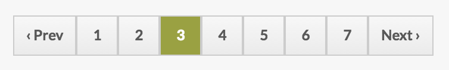

# Filtering, Pagination and Sorting

Filtering, pagination and column sorting all work through the same mechanism in Fae.

To use any one of these, you'll need to add a route to access the built in `filter` action.

```ruby
# config/routes.rb

resources :people do
  post 'filter', on: :collection
end
```

* [Filtering](#filtering)
  - [View Helpers](#view-helpers)
  - [Class Methods](#class-methods)
  - [Fae Filter Form](#fae-filter-form)
  - [Fae Filter Select](#fae-filter-select)
* [Pagination](#pagination)
* [Column Sorting](#column-sorting)

---

## Filtering

If you need to filter your content on your table views, Fae provides a system and helpers to do so.

Using the helpers provided, the filter form will POST to a filter action inherited from `Fae::BaseController`. You can override this action, but by default it will pass the params to a class method in your model called `filter`. It's then up you to scope the data that gets returned and rendered in the table.

Let's walk through an example. Using the `Person` model from above, let's say a person `belongs_to :company` and `has_many :groups`. We'll want to use select filters for companies and groups, and a keyword search to filter by people and company name.

### View Helpers

Next we'll add the form to our view as the first child of `.content`:

```slim
/ app/views/admin/people/index.html.slim

/ ...
.content

  == fae_filter_form do
    == fae_filter_select :company
    == fae_filter_select :groups

  table.js-sort-column
    / ...
```

The search field is built into `fae_filter_form`, but we'll need to provide a `fae_filter_select` for each select element in our filter bar.

### Class Methods

Finally we need to define our class methods to scope the `Person` class. This data will be assigned to `@items` and injected into the table via AJAX.

#### filter(params)

`ModelName#filter(params)` will be the scope when data is filtered. The `params` passed in will be the data directly from the `fae_filter_select` helpers we defined, plus `params['search']` from the search field.

From the form above we can assume our params look like this:

```ruby
{
  'search'  => 'text from search field',
  'company' => 12, # value from company select
  'groups'  => 3 # value from groups select
}
```

So let's use that data to craft our class method.

```ruby
# app/models/person.rb

def self.filter(params)
  # build conditions if specific params are present
  conditions = {}
  conditions[:company_id] = params['company'] if params['company'].present?
  conditions['groups.id'] = params['groups'] if params['groups'].present?

  # use good 'ol MySQL to search if search param is present
  search = []
  if params['search'].present?
    search = ["people.name LIKE ? OR companies.name LIKE ?", "%#{params['search']}%", "%#{params['search']}%"]
  end

  # apply conditions and search from above to our scope
  order(:name)
    .includes(:company, :groups).references(:company, :groups)
    .where(conditions).where(search)
end
```

#### filter_all

There's also a `ModelName#filter_all` which is called when you reset the filter form. This defaults to the `for_fae_index` scope, but you can override it if you need to.

```ruby
def self.filter_all
  where.not(name: 'John').order(:position)
end
```

### Fae Filter Form

```ruby
fae_filter_form
```


Displays the filter form, which includes the search field, submit, and reset buttons. It accepts options, followed by an optional block.

| option | type    | default                                | description |
|--------|---------|----------------------------------------|-------------|
| action | string  | "#{@index_path}/filter" | the path the form submits to |
| title  | string  | "Search #{@klass_humanized.pluralize.titleize}" | the h2 text in the filter form |
| search | boolean | true                                   | displays the search field |
| cookie_key | string | false | set your cookie name on the fae_filter_form if you want to persist the selected filtered state |


**Examples**

```slim
== fae_filter_form title: 'Search some stuff', search: false do
  // optional form elements
```

### Fae Filter Select

```ruby
fae_filter_select(attribute, options)
```


Dislays a select tag to be used within a `fae_filter_form`.

| option       | type                    | default                        | description |
|--------------|-------------------------|--------------------------------|-------------|
| label        | string                  | attribute.to_s.titleize        | label on select |
| collection   | ActiveRecord collection | AttributeAsClass.for_fae_index | the collection of AR objects to populate the select options |
| label_method | symbol                  | :fae_display_field             | the attribute to use as the label in the select options |
| placeholder  | string or boolean       | "All #{options[:label]}"       | the blank value in the select. It can be set to false to disable |
| options      | array                   | []                             | an alternative array of options if the options aren't an ActiveRecord collection |
| grouped_options | array                | []                             | an alternative array of grouped options if the options aren't an ActiveRecord collection |
| grouped_by   | symbol                  |                                | a Fae association on the models in `collection`. The association must have a `fae_display_name` method |

**Examples**

```slim
== fae_filter_form do
  == fae_filter_select :group, label: 'Groupings', collection: Groups.for_filters
  == fae_filter_select :group, label: 'Groupings', collection: Groups.for_filters, grouped_by: :filter
```

---

## Pagination



If your index tables are stacked with items and it's taking a while to load, you may consider adding pagination to them. To do this, just follow these steps.

Verify the object resources has the filter route:

```ruby
# config/routes.rb

resources :people do
  post 'filter', on: :collection
end
```

Then call the `fae_paginate` helper under the table:

`app/views/admin/people/index.html.slim`
```slim
/ app/views/admin/people/index.html.slim

table
  / table stuff here

== fae_paginate @items
```

The `fae_paginate` helper can be called anywhere and will return correct links to paginate `@items`, given `@items` is an ActiveRecord collection. However, directly under the table is where our CSS supports it. Other places may need additional CSS.

### Customize items per page

Pagination in Fae defaults to 25 items per page, but that can be customize in Fae's initializer:

```ruby
# config/initializers/fae.rb

Fae.setup do |config|
  ## per_page
  # Sets the default number of items shown in paginated lists
  # Defaults to 25
  config.per_page = 50
end
```

Under the hood Fae uses [Kaminari](https://github.com/amatsuda/kaminari) to power the pagination, so ther are additional ways to customize it, including:

* adding `paginates_per 50` to specific models
* overriding Fae's Kaminari initializer with your own
* ignore `fae_paginate` and use Kaminari's `paginate` directly
* etc...

### Enable Pagination in the Controller

Pagination is disabled in the Fad:BaseController by default. This can be customized with a private use_pagination method in controllers inheriting from Fae::BaseController.

```ruby
# app/controllers/admin/example_controller.rb

module Admin
  class ExamplesController < Fae::BaseController

      private

      def use_pagination
        true
      end

  end
end

```

---

## Column Sorting

Column sorting is easy to add in if you aren't paginating your table. Adding a `js-sort-column` class to the table will make the table headers clickable, allowing you to arrange the items in the table via the data in the column.

This method relies on the data already in the table, so if you are paginating your items, only the current page you're on will be sorted. This is probably not the expected functionality, but Fae has a second way of dealing with this.

### Getting pagination and column sorting to play nice together

Again, verify the object resources has the filter route:

```ruby
# config/routes.rb

resources :people do
  post 'filter', on: :collection
end
```

Then remove the old `js-sort-column` class from the table.

For each column you want enable, add a `data-sort` attr to the `<th>` following these conventions.

For an attribute on the current object:

```
data-sort="attribute_name"
```

To sort by an association's attribute:

```
data-sort="association_name.attribute_name"
```

`association_name` must be an existing column and `association_name` must be a defined association on the current object.

Here's an example:

```slim
/ app/views/admin/people/index.html.slim

table
  thead
    tr
      th data-sort="first_name" Name
      th data-sort="title" Title
      th data-sort="slug" Slug
      th data-sort="office.city" Location
      th.-action-wide data-sort="updated_at" Modified
      th.-action-wide On Stage
      th.-action-wide On Prod
```

```ruby
# app/models/person.rb

class Person < ActiveRecord::Base
  include Fae::BaseModelConcern

  belongs_to :office
end
```

