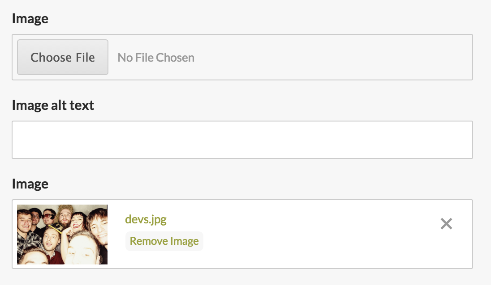
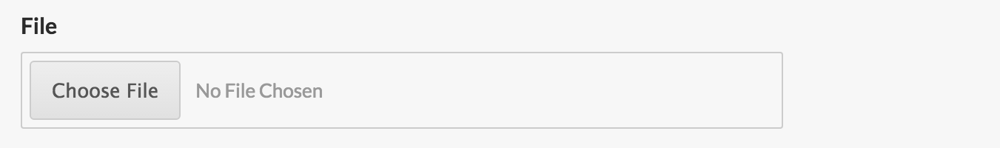
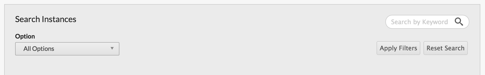
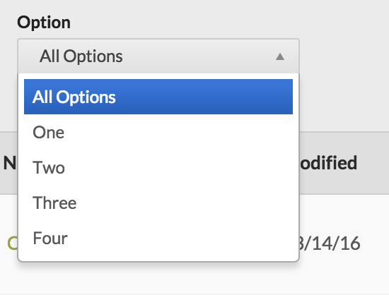

# Nested Form Helpers

* [Fae Image Form](#fae-image-form)
* [Fae File Form](#fae-file-form)
* [Fae Content Form](#fae-content-form)
* [Fae Filter Select](#fae-filter-select)

---

## Fae Image Form

```ruby
fae_image_form
```



*Fae::Image association only*

| option | type | default | description |
| ------ | ---- | ------- | ----------- |
| label         | string | image_name.to_s.humanize | the uploader's label |
| helper_text         | string | | the uploader's helper text|
| alt_label           | string | "#{image_label} alt text" | the alt field's label |
| alt_helper_text     | string | | the alt field's helper text |
| caption_label       | string | "#{image_label} caption" | the caption field's label |
| caption_helper_text | string | | the caption field's helper text |
| show_alt            | boolean | true | displays the alt field, label, and helper text |
| show_caption        | boolean | false | displays the caption field, label, and helper text |
| required            | boolean | false | adds required validation to the uploader |
| attached_as         | symbol | image_name.to_s | Sets the `attached_as` atrribute on upload. You'll need to customize this if your `attached_as` condition doesn't match the images associaiton name. |

**Examples**

```ruby
fae_image_form f, :logo, label: 'Corporate Logo', required: true
```

## Fae File Form

```ruby
fae_file_form
```



*Fae::File association only*

| option | type | default | description |
| ------ | ---- | ------- | ----------- |
| label         | string | file_name.to_s.humanize | the uploader's label |
| helper_text   | string | | the uploader's helper text|
| required      | boolean | false | adds required validation to the uploader |

image_label: nil, alt_label: nil, caption_label: nil, omit: nil, show_thumb: nil, required: nil, helper_text: nil, alt_helper_text: nil, caption_helper_text: nil


**Examples**

```ruby
fae_file_form f, :tasting_notes_pdf, helper_text: 'PDF format only'
```

## Fae Content Form

```ruby
fae_content_form
```

*Fae::TextField and Fae::TextArea association only*

| option | type | default | description |
| ------ | ---- | ------- | ----------- |
| label         | string | attribute.to_s.titleize | the fields's label |
| helper_text   | string | | the field's helper text |
| hint          | string | | the field's hint text (supports HTML) |
| markdown      | boolean | false | adds markdown GUI toolbar |
| markdown_supported | boolean | false | displays support text and hint for markdown |
| input_options | hash with simple form options | false | adds simple form options to the input field |

image_label: nil, alt_label: nil, caption_label: nil, omit: nil, show_thumb: nil, required: nil, helper_text: nil, alt_helper_text: nil, caption_helper_text: nil, wrapper_html: nil, input_options: nil

**Examples**

```ruby
fae_content_form f, :body, markdown: true
```

```ruby
fae_content_form f, :ad, input_options: { collection: ['Header', 'Footer'], input_html: { class: 'js-ad-field' }, wrapper_html { class: 'hidden' } }
```

## Fae Filter Form

```ruby
fae_filter_form
```



Displays the filter form, which includes the search field, submit, and reset buttons. It accepts options, followed by an optional block.

| option | type    | default                                | description |
|--------|---------|----------------------------------------|-------------|
| action | string  | "#{@index_path}/filter" | the path the form submits to |
| title  | string  | "Search #{@klass_humanized.pluralize.titleize}" | the h2 text in the filter form |
| search | boolean | true                                   | displays the search field |
| cookie_key | string | false | set your cookie name on the fae_filter_form if you want to persist the selected filtered state |


**Examples**

```slim
== fae_filter_form title: 'Search some stuff', search: false do
  // optional form elements
```

## Fae Filter Select

```ruby
fae_filter_select(attribute, options)
```



Dislays a select tag to be used within a `fae_filter_form`.

| option       | type                    | default                        | description |
|--------------|-------------------------|--------------------------------|-------------|
| label        | string                  | attribute.to_s.titleize        | label on select |
| collection   | ActiveRecord collection | AttributeAsClass.for_fae_index | the collection of AR objects to populate the select options |
| label_method | symbol                  | :fae_display_field             | the attribute to use as the label in the select options |
| placeholder  | string or boolean       | "All #{options[:label]}"       | the blank value in the select. It can be set to false to disable |
| options      | array                   | []                             | an alternative array of options if the options aren't an ActiveRecord collection |
| grouped_options | array                | []                             | an alternative array of grouped options if the options aren't an ActiveRecord collection |
| grouped_by   | symbol                  |                                | a Fae association on the models in `collection`. The association must have a `fae_display_name` method |

**Examples**

```slim
== fae_filter_form do
  == fae_filter_select :group, label: 'Groupings', collection: Groups.for_filters
  == fae_filter_select :group, label: 'Groupings', collection: Groups.for_filters, grouped_by: :filter
```
