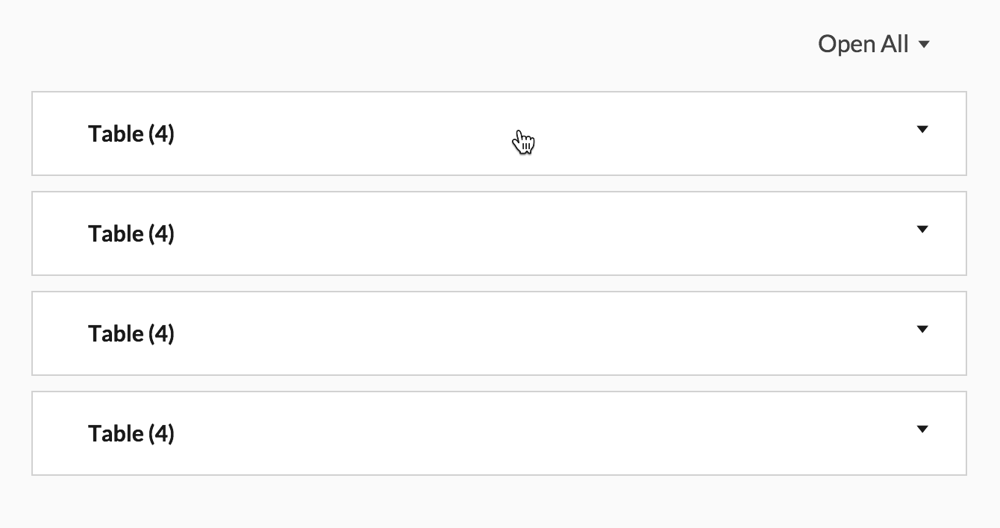

# Fae Styles

## Collapsible tables



Some pages have multiple tables that are easier to navigate if tables can be shown or hidden. Wrap each table in a `.collapsible` div and prepend an `h3` with the item's name and count. Example below and on the dummy app's `events/index` page.

```slim
.content
  .collapsible
    h3 All Wine (#{@all_wine.length})
    table
      ....
  .collapsible
    h3 White & Sparkling Wine (#{@white_sparkling_wine.length})
    table
      ....
```

For best results, include an Open/Close All toggle.

```slim
.content
  .collapsible-toggle Open All
  .collapsible
    ....
```