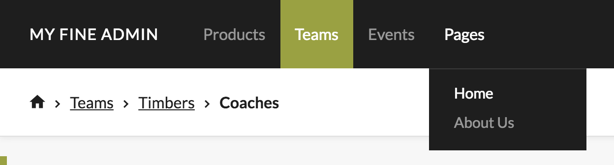

# Navigation Setup

When using Fae's installer and generators, navigation items to the objects you create will automatically get added to the side nav of the admin. Behind the scenes the generator is updating `app/models/concerns/fae/navigation_concern.rb`. However, this file is available for you to customize the nav however you like.

## Updating navigation_concern.rb

To define your own navigation structure you just need to update the `structure` method within `app/models/concerns/fae/navigation_concern.rb`. Here's a look at an example:

```ruby
def structure
  [
    item('Products', subitems: [
      item('Apparel', class: 'custom-class', path: admin_apparel_path),
      item('Beverage', subitems: [
        item('Wines', subitems: [
          item('Releases', path: admin_releases_path)
        ]),
        item('Board Games', path: admin_board_games_path)
      ]),
    ]),
    item('Pages', subitems: [
      item('Home', path: fae.edit_content_block_path('home')),
      item('About Us', path: fae.edit_content_block_path('about_us'))
    ])
  ]
end
```

`structure` is an array of nav items which are defined with the `item` method. The `item` method takes a title as the first argument, followed by a hash of options. To nest subitems within an item, pass an array of items into the `subitems` option.

```ruby
item(title, options = {})
```

| Option | Type | Description |
| --- | ---- | ----------- |
| path | string or named route* | the link's href (defaults to '#') |
| class | string | a custom class that gets added to the link |
| subitems | array of items | nested links to be displayed in a dropdown |

\* if you want to access a named route that exists in Fae, call the named route on the `fae` object.

```ruby
fae.pages_path
```

## Top Nav

Fae has an alternative top navigation that's ideal if you have a lot of objects or want to nest them more than two levels.



To enable the top nav, add this option to `config/initializers/fae.rb`:

```ruby
config.has_top_nav = true
```

### Top/Side Nav Hierarchy

When the top nav is enabled, the first and second level of `structure` defines the main nav and dropdown items respectively. When you click into a section that has third and/or fourth levels, a side nav will appear to display those items.

```ruby
def structure
  [
    item('Top nav item', subitems: [
      item('Top nav dropdown item', subitems: [
        item('Side nav item', subitems: [
          item('Side nav nested item', path: '#')
        ])
      ]),
    ])
  ]
end
```

If the main nav dropdown doesn't have a defined `path`, it will search the `subitems` for the first available path to link to.

Note: the side nav is hidden in forms by design, this removes clutter and allows the user to focus on the content of that object.

## Dynamic Content in the Navigation

Dynamic content can be defined in `navigation_concern.rb`. Here's an example:

```ruby
module Fae
  module NavigationConcern
    extend ActiveSupport::Concern

    def structure
      [
        item('Teams', subitems: team_subitems)
        # scaffold inject marker
      ]
    end

    private

    def team_subitems
      teams_arr = [ item('Team List', path: admin_teams_path) ]
      Team.all.each do |team|
        teams_arr << item(team.name, subitems: [
          item('Coaches', path: admin_team_coaches_path(team)),
          item('Players', path: admin_team_players_path(team))
        ])
      end
      teams_arr
    end
  end
end
```